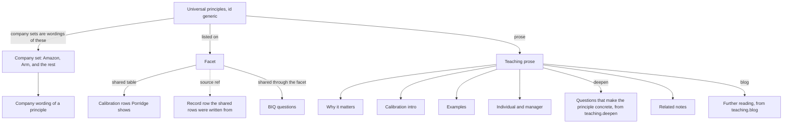
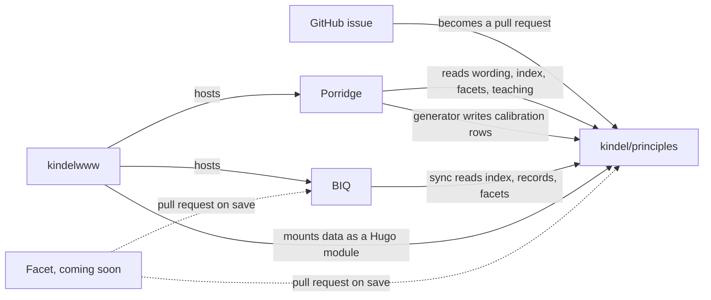

# principles

This repo is a central source of leadership principles, the behaviors that relate to them, questions that can be asked to test those behaviors, and the guidance for calibrating each behavior as under, just right, or over.

[BIQ](https://kindel.com/kld/apps/biq/) and [Porridge](https://kindel.com/kld/apps/porridge/) are already built on it.

The repo makes it easy for anyone to add more, or to improve the corpus. A new company, principle, behavior, or question starts in [Contribute without writing code](#contribute-without-writing-code).

## Inside

kindel/principles defines a set of universal principles that apply to any company. The id is `generic`. Some companies have their own version of these. Amazon, Arm, and the rest are company-specific wordings mapped onto the universal principles, and through them onto facets, calibration rows, questions, BIQ questions, teaching, and further reading. That is how an app like Porridge can be built for one company's employees.



A company set is that company's words. The words live in `data/<company>/<slug>.json`. Porridge uses that file for the name and the definition.

A company view gets facets, calibration rows, questions, BIQ questions, teaching, and further reading by mapping its wording onto the universal principle. `data/maps/` is where those maps live. Today the only file is `data/maps/generic-amazon.json`. It pairs each universal principle with the Amazon principle the wording was taken from, and lists the sentences that were edited. Intentional About Culture has no Amazon principle in this corpus. Its teaching was written for the universal principle. Arm, Coupang, Delivery Hero, GitLab, Dawn, and Toyota list their facets on the company record. Maps for those sets will be fixed soon.

A facet names one slice of behavior. The calibration table lives on the facet. Each row is a situation, with under, just right, and over. Every principle on that facet shares those rows. Porridge shows those rows. `scripts/validate.py` rejects a principle that has none (`validate_calibration_coverage`). CI runs that check from `.github/workflows/ci.yml`.

A principle can also hold record rows. Those are a person's writing, or a quotation of the company. A source ref on the facet points at a record row, which is where the shared rows were written from. Porridge shows the shared rows. Universal Leadership Principles ships definitions with empty record rows (`calibration` is `unpublished` in `scripts/companies.py`). The shared table is still required.

Teaching prose is in `data/teaching/`. Only Amazon and generic have it today, but that will be fixed soon. A teaching file holds why the principle matters, a calibration intro, examples, what it looks like for an individual and a manager, the deepen questions, and notes on related principles. Porridge's "Questions that make the principle concrete." is the `deepen` list. Further reading is the `blog` list on that same file: a title, a URL, and a note. Only Amazon and generic have further reading today, but that will be fixed soon. Teaching and further reading map through the facets and the universal principles, so any company view gets them, with that company's wording substituted.

BIQ keeps one question bank in [kindel/biq](https://github.com/kindel/biq) `data/questions.json`. A question hangs off a facet, and a company view gets it through the universal principle that wording maps to.

Today the long list is stored on the Amazon principles. Arm, Coupang, Dawn, GitLab, and Delivery Hero each store a shorter list of their own. Generic and Toyota store an empty list. An empty list inherits the questions of another principle on the same facet, which today is Amazon, plus any questions in `facetQuestions` for that facet. The per-company lists will be fixed soon.

Two facets are about the team. Best person for the role is the hire for one seat: the person who will do that work. Team for the outcome is the mix of backgrounds, thinking styles, and skills, chosen because the business result is better.

## Contribute without writing code

Open an issue. That is where a change starts. I, or an agent, turn it into a pull request. Say in the issue if you want your name on the pull request.

- Propose a company's principles. Name the company. Give the source: a link to the official page where they published them, or the name of a first-party document they have authorized us to publish. Say how you know them if you want.
- Improve an example or a calibration row. Name or link the principle, quote the current text, suggest the better text, and say why.
- Report something wrong or out of date. Say what it is and where it is.
- Suggest a new facet. Describe the behavior under, just right, and over. A blank issue is fine for this.

The first three have forms. If you write code, you can open a pull request directly. Read [AGENTS.md](AGENTS.md) first.

[Facet](https://github.com/kindel/facet), a web editor for browsing and improving the corpus, is coming soon.

Porridge and BIQ have a Give Feedback button. It files a GitHub issue on that app's repo, `kindel/porridge` or `kindel/biq`, with the label `feedback`. Use it for the app. Use an issue here for the principles.

## The sets

The name, what that set is called, and the source. This list is `scripts/companies.py`.

- Universal Leadership Principles, id `generic`, is the set this repo defines for any company. The set is called Leadership Principles. I wrote it.
- Amazon calls them Leadership Principles. Source: [amazon.jobs](https://www.amazon.jobs/content/en/our-workplace/leadership-principles).
- Arm calls them 10x Mindset. Source: [careers.arm.com](https://careers.arm.com/life-at-arm).
- Coupang calls them Leadership Principles. Source: [coupang.jobs](https://www.coupang.jobs/en/coupang-leadership-principles/).
- Delivery Hero calls them Leadership Principles. Source: [the launch post](https://careers.deliveryhero.com/delivery-hero/2025-4/launching-our-leadership-principles).
- GitLab calls them CREDIT Values. Source: [the handbook](https://handbook.gitlab.com/handbook/values/).
- Dawn Aerospace calls them Company Tenets. Source: Dawn Aerospace Company Tenets, Dawn's internal wiki, published with Dawn's permission.
- Toyota calls them The Toyota Way. Source: [the 2018 annual report](https://www.toyota-global.com/pages/contents/investors/ir_library/annual/pdf/2018/ar18_3_en.pdf).

## Outside

[Porridge](https://kindel.com/kld/apps/porridge/) is the user's manual. It reads the company wording, the index, the facets, and the teaching. It opens on the universal set. Pick a company and the page shows that company's wording. [BIQ](https://kindel.com/kld/apps/biq/) is the interview question bank. The catalog is [kindel.com/kld/apps](https://kindel.com/kld/apps/).

kindelwww is the host. It mounts this repo's `data/` as a Hugo module, and it mounts Porridge and BIQ the same way.

[Facet](https://github.com/kindel/facet) is the editor for browsing and improving the corpus. It is coming soon. A save will open a pull request on this repo and on [kindel/biq](https://github.com/kindel/biq). The route will be `/kld/apps/facet/` when the page is live.



The dotted lines are the pull requests Facet will open on save.

## Tenets

1. **A Principle is a Tenet About People.** A leadership principle is a tenet whose endeavor is an organization and whose subject is human behavior, so *we hold it to the tenet bar*: one idea and a trade-off a person can act on. A set that reads as slogans is a set we have not finished modeling.

2. **Behavior is the Unit.** A principle earns its place by decomposing into behavior a person can observe, teach, and live with the appropriate balance. *A behavior we cannot show under indexed, balanced, and over done is a slogan*, and we model it or drop it.

3. **Facets Compose, Wordings Differ.** Companies carve the same behavior into different principles, so their sets rarely line up one to one. *The facet is the granular piece that does line up*, and we compose principles from facets rather than re-authoring one behavior per company.

4. **Level and Role Change What Counts, Not What Good Looks Like.** Over doing it looks the same for a junior and an exec, so calibration does not move with level or role. What moves is which behaviors carry weight and the scope expected, and *the behavior is written once and projected*, because an app that keeps its own copy per level cannot be compared with the app beside it.

5. **The Core Owns the Model, Apps Own the Experience.** The core holds the lexicon, the taxonomy, the composition rules, and the code that enforces them. Apps hold questions, prompts, manuals, and pages, and *an app that reimplements the model has forked it*.

6. **Company is a Parameter, Never a Constant.** No code branches on a company's name, and *every lookup, path, and cache key carries the company*. A bare id fails silently, because `dive-deep` is four different principles.

7. **The Check is the Contract.** *A new rule ships with the check that fails on it*, or it is a suggestion. A rule only a human enforces is already broken somewhere in the tree.

8. **Break in the Open.** The core changes shape when the model demands it, and apps follow. *A breaking change ships with the issues and pull requests that fix each app*, so we accept the breakage and never the silence.

9. **A Copy is Generated and Verified, or It Does Not Exist.** An app that must serve the model from its own origin generates its copy from a pin and fails its build on drift. *A copy a human keeps in step is drift with a delay.*

Unless you know better ones.

## For developers

[SCHEMA.md](SCHEMA.md) is the contract. [AGENTS.md](AGENTS.md) is how you add a company, and how the apps consume this.

```
data/index.json                  manifest, generated by scripts/build_index.py
data/facets.json                 facets and the shared calibration rows
data/<company>/<slug>.json       one principle, the company wording
data/teaching/<company>/         teaching prose; Amazon and generic today
data/maps/generic-amazon.json    a universal principle paired with an Amazon principle
scripts/validate.py              the build check, including calibration coverage
scripts/build_index.py           regenerates the manifest
.github/workflows/ci.yml         validate, tests, and a fresh manifest
```

Run `python3 scripts/validate.py` before you commit.

## License

MIT. Copyright (c) 2026 Kindel, LLC. Keep the copyright notice and permission notice in all copies.
