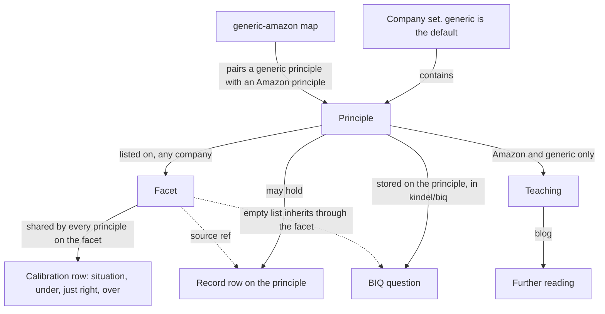
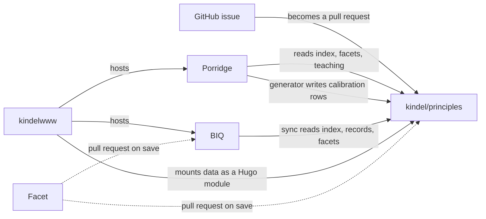

# principles

I keep one model of leadership principles here. A principle is a behavior, written so you can see it under, just right, and over. The apps read these records. They do not keep a second copy.

> **A principle** is one behavior, shown under, just right, and over.

The default set is Universal Leadership Principles. The id is `generic`. An app shows that set until you pick a company. A company set is an alternate view, in that company's words.

## Inside



A company set contains principles. `generic` is first in the manifest, so it is the default.

A facet names one slice of behavior. It lists the principles, from any company, that contain that slice. The calibration table lives on the facet. Each row is a situation, with under, just right, and over. Every principle on that facet shares those rows. Porridge shows those rows.

A principle can also hold record rows. Those are a person's writing, or a quotation of the company. A source ref on the facet points at a record row. That is the source the shared rows were written from, not the table Porridge shows. Universal Leadership Principles ships definitions with no record rows (`calibration` is `unpublished` in `scripts/companies.py`). The shared table is still required.

Every principle has a calibration table. `scripts/validate.py` rejects a principle that has none. The check is `validate_calibration_coverage`. CI runs it from `.github/workflows/ci.yml`.

Teaching prose is in `data/teaching/`. Only Amazon and `generic` have it. Further reading is the `blog` list on a teaching file: a title, a URL, and a note. `data/maps/generic-amazon.json` pairs a generic principle with the Amazon principle it reuses, and lists the sentences that were edited. Intentional About Culture has no Amazon principle in this corpus, so that pair has no target. Its teaching was written for it.

BIQ questions are not in this repo. They live in kindel/biq, stored on a principle. A principle with an empty question list inherits the questions of another principle that shares a facet. `generic` and Toyota store an empty list and inherit. The other sets store their own questions on the principle.

Two facets are about the team. Best person for the role is the hire for one seat: the person who will do that work. Team for the outcome is the mix of backgrounds, thinking styles, and skills, chosen because the business result is better. Those two are not in `data/facets.json` on main. They are in [pull request 75](https://github.com/kindel/principles/pull/75).

## Contribute without writing code

Open an issue. That is where a change starts. I, or an agent, turn it into a pull request. Say in the issue if you want your name on the pull request.

- Propose a company's principles. Name the company, link the official page where they published them, and, if you want, say how you know them.
- Improve an example or a calibration row. Name or link the principle, quote the current text, suggest the better text, and say why.
- Report something wrong or out of date. Say what it is and where it is.
- Suggest a new facet. Describe the behavior under, just right, and over. A blank issue is fine for this.

The first three have forms. If you write code, you can open a pull request directly. Read [AGENTS.md](AGENTS.md) first.

Porridge and BIQ have a Give Feedback button. It files a GitHub issue on that app's repo, `kindel/porridge` or `kindel/biq`, with the label `feedback`. It does not open an issue here. Use it for the app. Use an issue here for the principles.

## The sets

The name, what that set is called, and the source. This list is `scripts/companies.py`.

- Universal Leadership Principles, id `generic`, is the default. The set is called Leadership Principles. Source: [issue 71](https://github.com/kindel/principles/issues/71).
- Amazon calls them Leadership Principles. Source: [amazon.jobs](https://www.amazon.jobs/content/en/our-workplace/leadership-principles).
- Arm calls them 10x Mindset. Source: [careers.arm.com](https://careers.arm.com/life-at-arm).
- Coupang calls them Leadership Principles. Source: [coupang.jobs](https://www.coupang.jobs/en/coupang-leadership-principles/).
- Delivery Hero calls them Leadership Principles. Source: [the launch post](https://careers.deliveryhero.com/delivery-hero/2025-4/launching-our-leadership-principles).
- GitLab calls them CREDIT Values. Source: [the handbook](https://handbook.gitlab.com/handbook/values/).
- Dawn Aerospace calls them Company Tenets. The source is not a public URL. It is Dawn Aerospace Company Tenets, Dawn's internal wiki, published with Dawn's permission.
- Toyota calls them The Toyota Way. Source: [the 2018 annual report](https://www.toyota-global.com/pages/contents/investors/ir_library/annual/pdf/2018/ar18_3_en.pdf).

## Outside

[Porridge](https://kindel.com/kld/apps/porridge/) is the user's manual. It reads the index, the facets, and the teaching. [BIQ](https://kindel.com/kld/apps/biq/) is the interview question bank. The catalog is [kindel.com/kld/apps](https://kindel.com/kld/apps/).

Facet is the editor. A save opens a pull request on this repo and on [kindel/biq](https://github.com/kindel/biq). That editor is in progress on kindelwww#259. The repo is [kindel/facet](https://github.com/kindel/facet). The route will be `/kld/apps/facet/` when the page is live.

kindelwww is the host. It mounts this repo's `data/` as a Hugo module, and it mounts Porridge and BIQ the same way.



Dotted lines are the editor, which is not live yet. The other arrows are what the repos do today.

## Tenets

1. **A Principle is a Tenet About People.** A leadership principle is a tenet whose endeavor is an organization and whose subject is human behavior, so *we hold it to the tenet bar*: one idea and a trade-off a person can act on. A set that reads as slogans is a set we have not finished modeling.

2. **Behavior is the Unit.** A principle earns its place by decomposing into behavior a person can observe, teach, and live with the appropriate balance. *A behavior we cannot show under indexed, balanced, and over done is a slogan*, and we model it or drop it.

3. **Facets Compose, Wordings Differ.** Companies carve the same behavior into different principles, so their sets rarely line up one to one. *The facet is the granular piece that does line up*, and we compose principles from facets rather than re-authoring one behavior per company.

4. **Level and Role Change What Counts, Not What Good Looks Like.** Over doing it looks the same for a junior and an exec, so calibration does not move with level or role. What moves is which behaviors carry weight and the scope expected, and *the behavior is written once and projected*, because an app that keeps its own copy per level cannot be compared with the app beside it.

5. **The Core Owns the Model, Apps Own the Experience.** The core holds the lexicon, the taxonomy, the composition rules, and the code that enforces them. Apps hold questions, prompts, manuals, and pages, and *an app that reimplements the model has forked it*.

6. **Company is a Parameter, Never a Constant.** No code branches on a company's name, and *every lookup, path, and cache key carries the company*. A bare id fails silently, because `dive-deep` is four different principles.

7. **The Check is the Contract.** *A new rule ships with the check that fails on it*, or it is a suggestion. A rule only a human enforces is already broken somewhere in the tree.

8. **Break in the Open.** The core changes shape when the model demands it, and apps follow. *A breaking change ships with the issues and pull requests that fix each app*, so we accept the breakage and never the silence.

9. **A Copy is Generated and Verified, or It Does Not Exist.** An app that must serve the model from its own origin generates its copy from a pin and fails its build on drift. *A copy a human keeps in step is drift with a delay.*

Unless you know better ones.

## For developers

[SCHEMA.md](SCHEMA.md) is the contract. [AGENTS.md](AGENTS.md) is how you add a company, and how the apps consume this.

```
data/index.json                  manifest, generated by scripts/build_index.py
data/facets.json                 facets and the shared calibration rows
data/<company>/<slug>.json       one principle
data/teaching/<company>/         teaching prose; Amazon and generic
data/maps/generic-amazon.json    which generic principle reuses which Amazon principle
scripts/validate.py              the build check, including calibration coverage
scripts/build_index.py           regenerates the manifest
.github/workflows/ci.yml         validate, tests, and a fresh manifest
```

Run `python3 scripts/validate.py` before you commit.

## License

MIT. Copyright (c) 2026 Kindel, LLC. Keep the copyright notice and permission notice in all copies.
