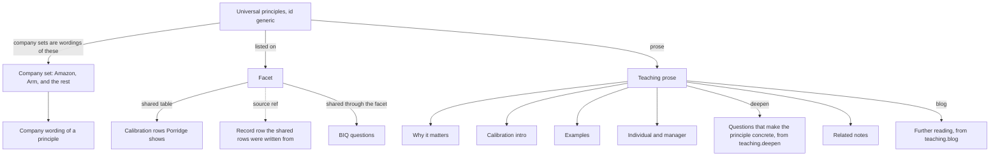
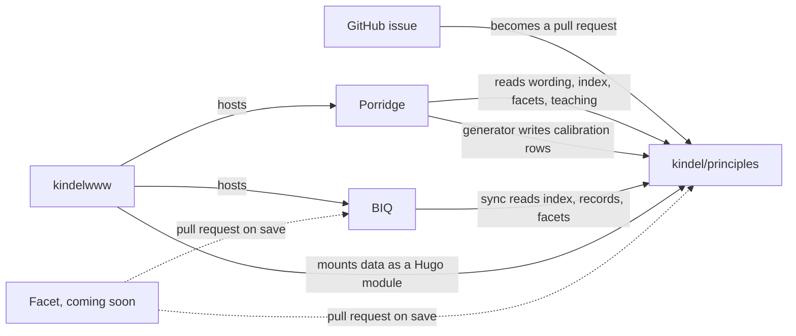

# principles

This repo is a central source of leadership principles, the behaviors that relate to them, questions that can be asked to test those behaviors, and the guidance for calibrating each behavior as under, just right, or over.

[Porridge](https://kindel.com/kld/apps/porridge/) is the user's manual. It opens on the universal set, and picking a company shows that company's wording of the same principles. [BIQ](https://kindel.com/kld/apps/biq/) is the interview question bank. A company sees the questions for a principle once its wording is mapped onto that principle. Both apps are in the [catalog](https://kindel.com/kld/apps/).

## Inside

The universal set, id `generic`, is the root, and company sets are wordings mapped onto it, so an app like Porridge can be built for one company's employees.

Teaching prose is in `data/teaching/`. Only Amazon and generic have it today, but that will be fixed soon. Porridge's "Questions that make the principle concrete." is the `deepen` list on that teaching file.

The other companies in the corpus are Amazon, Arm, Coupang, Delivery Hero, GitLab, Dawn Aerospace, and Toyota. What each calls the set, and where the wording came from, is in `scripts/companies.py`. The record shape is [SCHEMA.md](SCHEMA.md).

## Outside

kindelwww hosts the apps and mounts this repo's `data/` as a Hugo module.

The dotted lines are the pull requests Facet will open on save.

## Contribute

Anyone can add a company, a principle, a behavior, or a question, or improve what is here. Open an issue, and I or an agent will turn it into a pull request. Say in the issue if you want your name on it. The forms cover a company's principles (the official page, or the name of a document they have authorized us to publish), a better example or calibration row, and something wrong or out of date. A new facet can be a blank issue. If you are writing the code, start with [AGENTS.md](AGENTS.md) and [SCHEMA.md](SCHEMA.md).

[Facet](https://github.com/kindel/facet), a web editor for browsing and improving the corpus, is coming soon.

The Give Feedback button on Porridge and BIQ files an issue on that app's repo. For the principles themselves, open the issue here.

## License

MIT. Copyright (c) 2026 Kindel, LLC. Keep the copyright notice and permission notice in all copies.
